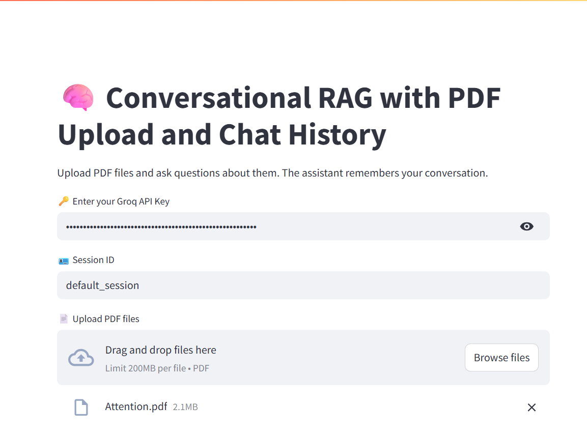
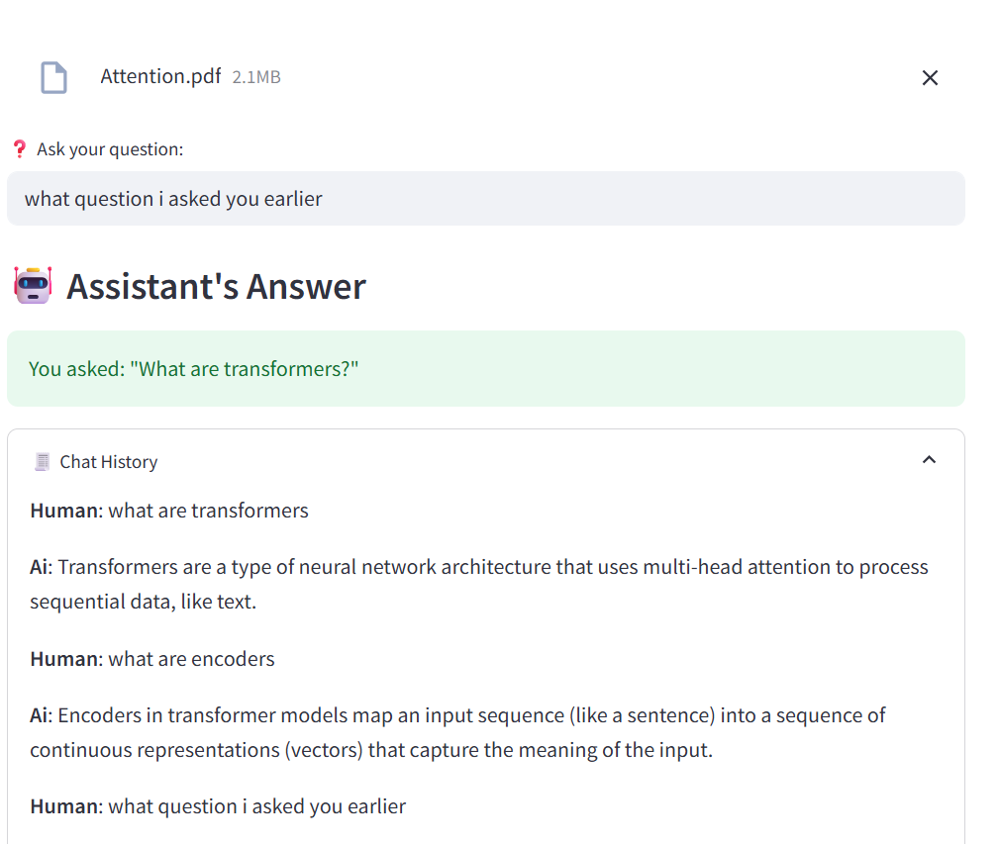

````markdown
# Conversational RAG with PDF Upload and Chat History

A **Streamlit-based web application** that enables users to upload PDF documents, ask context-aware questions about their content, and maintain a chat history. It leverages a **Retrieval-Augmented Generation (RAG)** pipeline using **LangChain**, **Groq**, and **Chroma** to provide accurate and contextually relevant responses.

---

## 🚀 Features

- **PDF Upload**: Upload one or more PDF files and extract their text content.
- **Conversational Q&A**: Ask questions about the uploaded documents and get smart, context-based answers.
- **Chat History**: Maintains conversational flow and remembers previous questions for follow-ups.
- **Vector Search**: Uses Chroma and HuggingFace embeddings for efficient retrieval of relevant chunks.
- **User-Friendly Interface**: Intuitive UI built with Streamlit.
- **Customizable Sessions**: Identify and track individual sessions with unique session IDs.

---

## 🛠 Tech Stack

- **Python** – Core language for backend logic.
- **Streamlit** – For building the interactive front-end.
- **LangChain** – Manages RAG pipeline and conversation memory.
- **Groq (Gemma2-9b-It)** – Language model for answering questions.
- **Chroma** – Vector database to index and retrieve document embeddings.
- **HuggingFace BGE Embeddings** – Converts text into dense vectors for similarity matching.
- **PyPDFLoader** – Parses and extracts text from PDF files.

---

## 📦 Prerequisites

Before getting started, make sure you have:

- Python 3.8 or higher
- Groq API key 
- Git
- Virtual environment (optional, but recommended)

---

## 📥 Installation

1. **Clone the Repository:**
   ```bash
   git clone https://github.com/your-username/your-repo-name.git
   cd your-repo-name
````

2. **Set Up a Virtual Environment (optional):**

   ```bash
   python -m venv venv
   source venv/bin/activate  # Windows: venv\Scripts\activate
   ```

3. **Install Dependencies:**

   ```bash
   pip install -r requirements.txt
   ```

   If `requirements.txt` is missing:

   ```bash
   pip install streamlit langchain langchain-community langchain-groq chromadb sentence-transformers pypdf
   ```

4. **Run the Application:**

   ```bash
   streamlit run app.py
   ```

   Replace `app.py` with your script filename if different.

---

## 💡 Usage

1. Launch the app using `streamlit run app.py`.
2. It will open in your browser at `http://localhost:8501`.
3. Enter your **Groq API key** in the secure input field.
4. Specify a **Session ID** or use the default (`default_session`).
5. Upload one or more **PDF files**.
6. Start asking questions about the PDF contents.
7. View ongoing **chat history** in the expandable sidebar section.

---

## 🧪 Example Interaction

* **Uploaded PDF**: A document about machine learning

* **Q**: "What is supervised learning?"

* **A**: "Supervised learning is a type of machine learning where the model is trained on labeled data, with input-output pairs, to predict outcomes for new data."

* **Q**: "Can you give an example?"

* **A**: "An example of supervised learning is email spam detection, where the model learns from labeled emails (spam or not spam) to classify new emails."

---

## 📁 Project Structure

```
RAG-QnA-from-pdf-with-chat-history/
├── app.py              # Main Streamlit app script
├── README.md           # This file
└── requirements.txt    # List of Python dependencies
```

---

## 📸 Screenshots

Include screenshots or GIFs of your working demo here:




> Tip: Upload your images to the repo or link to externally hosted images.

---

## 🤝 Contributing

We welcome contributions!

1. Fork the repository.
2. Create a feature branch:

   ```bash
   git checkout -b feature/your-feature-name
   ```
3. Make your changes and commit:

   ```bash
   git commit -m "Add your feature"
   ```
4. Push the branch:

   ```bash
   git push origin feature/your-feature-name
   ```
5. Open a pull request 🚀

---

## 📄 License

This project is licensed under the **MIT License**.
See the [LICENSE](LICENSE) file for more details.

---

## 📬 Contact

Have questions or feedback?
Open an issue or reach out at: **[satyampant420.com](mailto:satyampant420.com)**

---

**Built with ❤️ using Streamlit, LangChain, and Groq**

